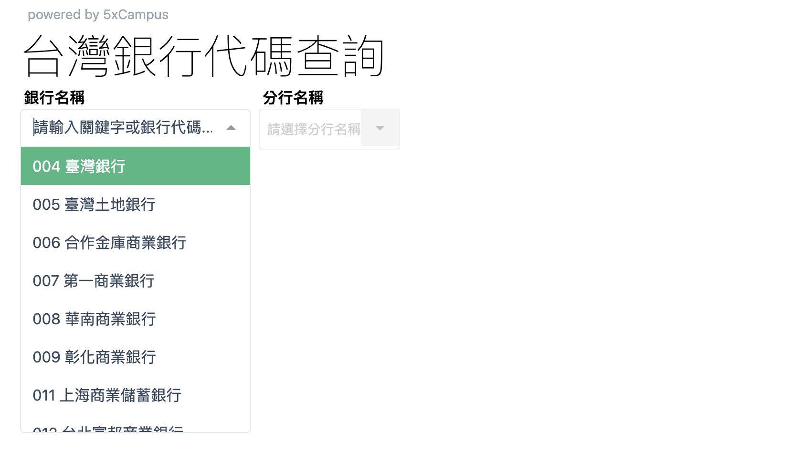
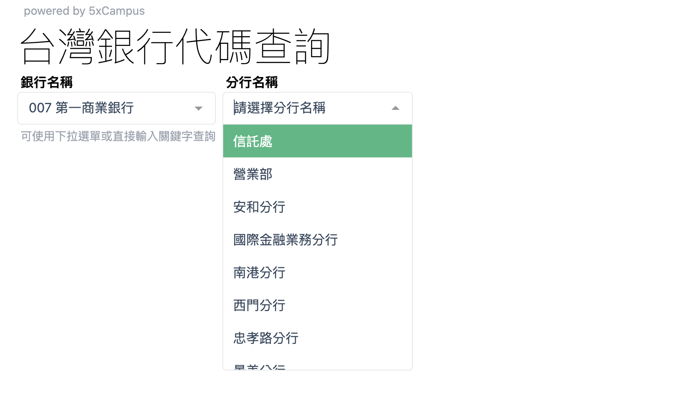
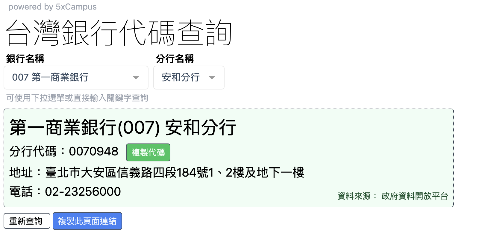

# 台灣銀行代碼查詢

此專案復刻自 [五倍學院](https://5xcampus.com/) 提供的 [台灣銀行代碼查詢](https://bank.5xcamp.us/) 。

台灣銀行代碼查詢提供使用者快速查詢台灣各大銀行及其分行的代碼、地址及電話資訊。此專案基於 Vue 3 開發，結合政府資料開放平台提供的 API 資料。

## 部署連結

已透過 Netlify 部署： [台灣銀行代碼查詢](https://bankcode.netlify.app/)

## 專案功能

- 支援以銀行名稱或代碼進行查詢。
- 提供分行詳細資訊，包括分行代碼、地址及聯絡電話。
- 一鍵複製分行代碼及當前頁面連結。
- 支援動態路由，透過 URL 直接進入指定分行頁面。

## 使用技術

- **前端框架**: [Vue 3](https://vuejs.org/)
- **路由管理**: [Vue Router](https://router.vuejs.org/)
- **選單工具**: [Vue - multiselect](https://vue-multiselect.js.org/)
- **剪貼簿工具**: [VueUse - useClipboard](https://vueuse.org/core/useClipboard/)
- **API 請求**: [Axios](https://www.npmjs.com/package/axios)
- **CSS 工具**: [Tailwind CSS](https://tailwindcss.com/)

## 資料來源

專案使用的銀行與分行資料來源於 [政府資料開放平台](https://data.gov.tw/dataset/6041)。

## 專案頁面範例

1. 使用者可從下拉選單或搜尋框選擇銀行名稱。
   
2. 選定銀行後，會顯示該銀行的所有分行，供使用者選擇。
   
3. 選擇分行後，會顯示該分行的詳細資訊，包含分行代碼、地址及電話。
   
4. 使用者可以直接複製分行代碼或當前頁面連結，方便分享，亦可重新查詢。

## 快速開始

### 環境需求

- Node.js (推薦 v22.11.0 或更高版本)
- npm 或 yarn

### 安裝步驟

1. 複製專案

```sh
git clone https://github.com/wanruliao/bank.git
cd bank
```

2. 安裝依賴

```sh
npm install
```

3. 啟動開發伺服器

```sh
npm run dev
```

4. 開啟瀏覽器訪問，預設會啟動於 http://localhost:5173。

   如遇 CORS 問題，可使用 chrome 擴充工具。

   例如：[Allow CORS](https://chromewebstore.google.com/detail/allow-cors-access-control/lhobafahddgcelffkeicbaginigeejlf)。

### 部署

```sh
npm run build
```

## 開發者資訊

### 廖婉如

> wan0917ru@gmail.com
